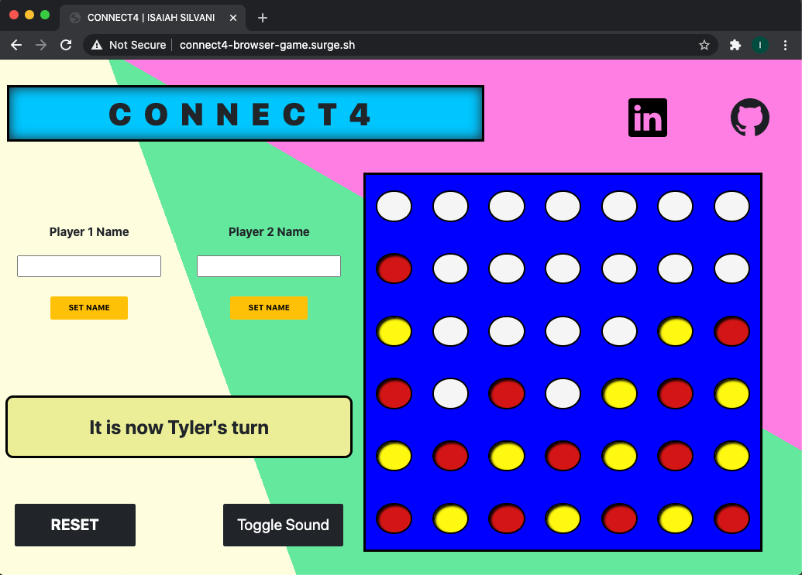
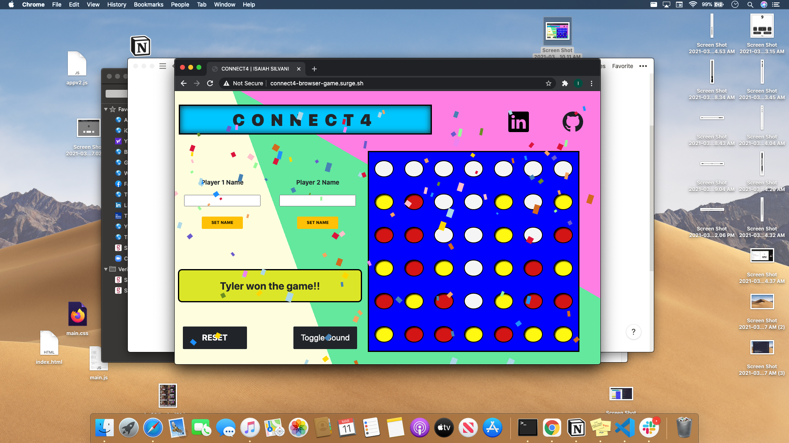
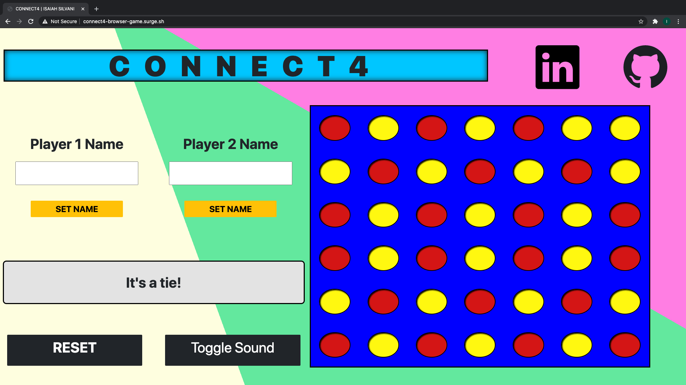

# CONNECT4, THE BROWSER GAME
### Thank you for checking out my game!
## Play this game [now!](https://www.connect4-game.com)
## Wireframe

## Introduction
This application is a recreation of the famous 2-player game, Connect 4! The goal of making this app was to not only provide a source of entertainment, but also to ingrain the principles of mobile design first and manipulating data structures. Overall, this was an extremely fun game not only to play, but also to make.
## Instructions
 Players have the option to set their names in the game before playing for even more immersion, and can even change their names mid-game without having to start over. When a player is prompted that is it their turn, a player will choose which empty space will be filled be his player chip color (either red or yellow). After that, the turn will switch to the other player who will choose which empty space to place his chip in. If a column is filled, the player has to select a different one. If a row of 4 is met in any direction, that player wins the game. If all the spaces are filled and there is no winner, a tie message will be displayed

 ## User Experience
 ### User Persona #1
 John just got home from a long day of work, only to discover that his roommate has not taken out the trash. Upon discussing this with his roommate, they realize that they never set a rule for who takes out the trash. John has the great idea of using Connect 4 as a way to determine who will take out the trash. Instead of pulling out the game board and spending the time to set it up, John simply visits my web application to produce a game of Connect 4.

 ### User Persona #2
 Sheryl is a mom with 2 young kids. Oftentimes, the kids will get bored on long road trips and begin fighting with each other out of boredom. Instead of Sheryl pulling over the car for 5 minutes to sort this altercation out, she simply pulls over real quick, takes out her Tablet from her purse and loads up the Connect4 Browser Game. She hands it to her kids, who became suddenly quiet and enthralled with playing the game with each other. Sheryl gets back on the road, glad that she knew about the Connect4 Browser Game.
## Gameplay Screenshots

## Technologies Used
JavaScript, HTML5, CSS3, and Bootstrap
## Accessiblity
This web application features a Mobile Design First approach so that anyone with a device a browser and internet connection can play my game. Furthermore, the webAim contrast checker was used when selecting the various colors to make this a very pleasant user experience.
## Pseudo-code=
1. Structure the mobile-design first web application using HTML/CSS grid/ Flexbox and Bootstrap
    1. HTML Structure
        1. title: CONNECT 4
        2. From start to end after the title, set to display flex
        3. Player1.name input field, player1.color input field, set-settings button>
     1. Player2.name input field, player2.color input field, set-settings button>
        1. Create a bunch of divs 67 in total in a row that have ID's to match their corresponding cell position row-->00<---column
        2. Close the div
        3. Output message to the user will go here>
        4. Social icons for github and linkedin
2. WRITE THE CSS
    1. Reset the CSS using provided structure that David gave us
    2. Set CSS grid to follow these specifications:
        1. grid-template-column: 1fr 1fr
        2. grid-template-row: 1fr 2.25fr 3.75fr 1fr 1.25fr
        3. grid-areas:
            1. title | title
            2. player1-settings | player2-settings
            3. board-grid | board-grid
            4. message | message
            5. bottom | bottom
        4. Set up grid-area of each HTML element on the page
        5. Set flex-display settings for the elements so they appear as they do in the wire frame
3. WRITE THE JAVASCRIPT
    1. Set up player1 and player2 objects, and give them default key-value pairs of name: player1 || player 2
    2. Set up ability to change player1 and player2 properties using the input fields, 
        1. Get the player1 and player2 name 
        2. Use that text to replace the corresponding keys with new values provided by input field upon set button being clicked to corresponding player
        3. Set both name from input field to JS data object model. DO NOT ACTUALLY USE THESE NAMES TRACK THE BOARD. A user can break your code simply by changing these key-value pairs mid game. "1" will represent player1 behind the scene, "-1" will represent player 2 behind the scenes.
        4. Change innerText of button from "Set" to "Set!"change color and disable to event listener to avoid code break
    3. Set the turn to = 1 to represent player one going first. There will be a message ouput, "player 1 go first" upon inititilization
    4. Create 2D array to represent the board in initilization. For each child div in the board-game div create an object wth key-value pairs of  make an array up to 7 elements long and push that to the intial board array. Keep pushing 7 element long arrays until you looped through every child div in the board-game div
    5. Add event listeners to every cell. When clicked, program will check if that cell's column has an available row. If so, go down the column and check what the next available spot is. The cell becomes occupied if the cell "underneath it"'s object.turn = 1 || -1, or if the last cell is at the very bottom
    6. For every click/turn, check to see if we have any winning combinations of conditions, if it's in a row for player1 or player2. Since we're using a 2D array, we can seperate the row and column and do math to target the cells in a row
    7. When we have that winning combition, set isWinner to the player, display congradulations output, throw in some confetti and disable clicking on the board
    8. Count how many turns are taken by each player. There are a total of 42 turns that can be taken. When 42 turns has been reached, display tied game message and play awwww sound

## Next Steps
- Increase character limit for name input by decreasing font size after a certain length
- Replace falling confetti on win with red and yellow connect4 pieces 

## Credits
#### Sounds
[Crowd Cheer](https://soundcloud.com/59nxyejat3xt/audience-applause-matthiew11-1206899159)\
[Crowd Aww](https://instrumentalfx.co/crowd-disappointed-sound-effect/)\
[Board Click](https://www.zapsplat.com/music/single-click-screen-press-on-smart-phone-3/)

#### Styling
[Multi-Color Background](https://blog.prototypr.io/css-only-multi-color-backgrounds-4d96a5569a20)

#### Effects
[Confetti](https://www.npmjs.com/package/confetti-js)
