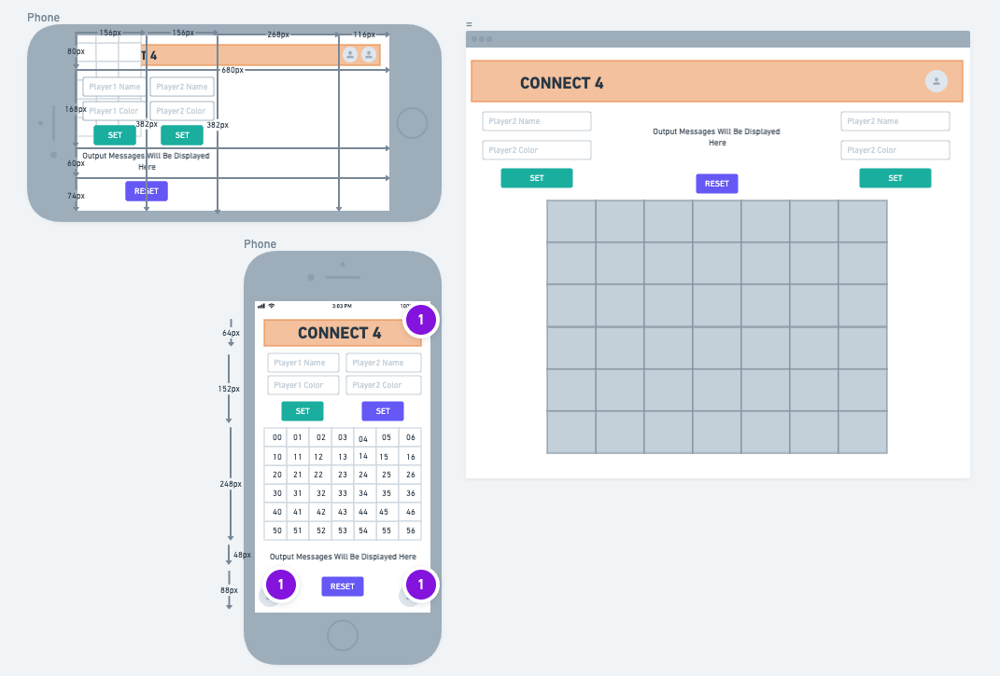

# Thank you for checking out my game!
## Play this game [now!](connect4-browser-game.surge.sh)
## Wireframe

## User Story
1. User loads page, and board is randomly set to either have Player 1 or Player 2 go first.
2. Players will have option to customize their names
3. The message output field will have a background color to signify who's turn it currently is
4. When player selects an empty white space on the board, whether filled or empty, program will check for the next empty  space by checking the column top to bottom; like a human would
5. The last empty space in the selected column will turn to the current player's color
6. The turn is switched to the other player, message output is set to that player's color, and empty white space is filled with other player color upon click
7. Keep rotating turns until a row of 4 is met, in either a ROW, COLUMN, DOWN-DIAGNOL or UP-DIAGNOL direction.
8. If a row is met, display victory message, confetti and applause
9. If there is a tie, display a tie message and a crowd awww sound
## Pseudo-code
1. Structure the mobile-design first web application using HTML/CSS grid/ Flexbox and Bootstrap
    1. HTML Structure
        1. title: CONNECT 4
        2. From start to end after the title, set to display flex
        3. Player1.name input field, player1.color input field, set-settings button>
     1. Player2.name input field, player2.color input field, set-settings button>
        1. Create a bunch of divs 67 in total in a row that have ID's to match their corresponding cell position row-->00<---column
        2. Close the div
        3. Output message to the user will go here>
        4. Social icons for github and linkedin
2. WRITE THE CSS
    1. Reset the CSS using provided structure that David gave us
    2. Set CSS grid to follow these specifications:
        1. grid-template-column: 1fr 1fr
        2. grid-template-row: 1fr 2.25fr 3.75fr 1fr 1.25fr
        3. grid-areas:
            1. title | title
            2. player1-settings | player2-settings
            3. board-grid | board-grid
            4. message | message
            5. bottom | bottom
        4. Set up grid-area of each HTML element on the page
        5. Set flex-display settings for the elements so they appear as they do in the wire frame
3. WRITE THE JAVASCRIPT
    1. Set up player1 and player2 objects, and give them default key-value pairs of name: player1 || player 2
    2. Set up ability to change player1 and player2 properties using the input fields, 
        1. Get the player1 and player2 name 
        2. Use that text to replace the corresponding keys with new values provided by input field upon set button being clicked to corresponding player
        3. Set both name from input field to JS data object model. DO NOT ACTUALLY USE THESE NAMES TRACK THE BOARD. A user can break your code simply by changing these key-value pairs mid game. "1" will represent player1 behind the scene, "-1" will represent player 2 behind the scenes.
        4. Change innerText of button from "Set" to "Set!"change color and disable to event listener to avoid code break
    3. Set the turn to = 1 to represent player one going first. There will be a message ouput, "player 1 go first" upon inititilization
    4. Create 2D array to represent the board in initilization. For each child div in the board-game div create an object wth key-value pairs of  make an array up to 7 elements long and push that to the intial board array. Keep pushing 7 element long arrays until you looped through every child div in the board-game div
    5. Add event listeners to every cell. When clicked, program will check if that cell's column has an available row. If so, go down the column and check what the next available spot is. The cell becomes occupied if the cell "underneath it"'s object.turn = 1 || -1, or if the last cell is at the very bottom
    6. For every click/turn, check to see if we have any winning combinations of conditions, if it's in a row for player1 or player2. Since we're using a 2D array, we can seperate the row and column and do math to target the cells in a row
    7. When we have that winning combition, set isWinner to the player, display congradulations output, throw in some confetti and disable clicking on the board
    8. Count how many turns are taken by each player. There are a total of 42 turns that can be taken. When 42 turns has been reached, display tied game message and play awwww sound

## Credit
#### Sounds
[Crowd Cheer](https://soundcloud.com/59nxyejat3xt/audience-applause-matthiew11-1206899159)\
[Crowd Aww](https://instrumentalfx.co/crowd-disappointed-sound-effect/)\
[Board Click](https://www.zapsplat.com/music/single-click-screen-press-on-smart-phone-3/)

#### Styling
[Multi-Color Background](https://blog.prototypr.io/css-only-multi-color-backgrounds-4d96a5569a20)